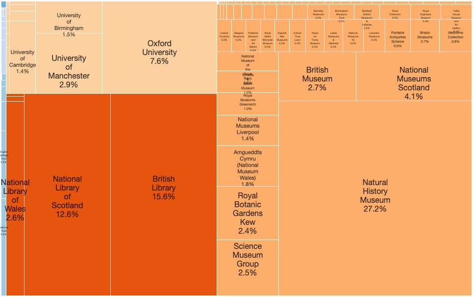

# UK National Collections Dashboard

(work in progress, please do not quote the figures/illustrations)

:::{figure-md} intro-fig


Treemap diagram showing by area what percentage of the UK National Collection is contributed by each institution (with many caveats, gaps and assumptions).
:::


The above (static) visualisation and the following notebooks with interactive visualisations are an
optimistic attempt to visualise the extent of the UK National Collection of 'Artefacts'. That is,
everything held in the collections of museums, libraries, galleries and archives
(and in some castles and gardens and houses and so on) of the UK, and the extent
to which they have been catalogued (or not), digitised (or not), and made available online (or not).
And, with further updates, to chart progress towards the goal over time over making more of it
available online as part of a "national collection", in whatever form that takes.

The list of 216 institutions is taken from the report commisioned by the 
'Towards a National Collection' project - "[Digital Collections Audit](https://museumdata.uk/wp-content/uploads/2023/11/Digital-Audit.pdf)
by Kevin Gosling & Gordon McKenna (Collections Trust), Adrian Cooper (Intelligent Heritage) - March 2022" with some additions. The
visualisations here are very much inspired by this work, but are not associated with or commisioned by Towards a National Collection
(or indeed by anyone but me).

The statistics presented here in various forms are taken from the institutions
collections websites (where available). A huge amount of personal 
interpretation has been taken after carrying out a brief review of the website or annual report, 
interpretation that is needed because of the variety of ways collections can be arranged,
counted and understood; needed because of the lack of definition of the words artefacts, collections,
items, objects, archives and needed because of the vaguaries of artefact records are made searchable online.
Additionally there are three overwhelmingly dominant types of collection:

  * Collections holding natural history specimens
  * Library Collections
  * Archives

For the first two the issue is one of scale, they contain collections magnitudes larger in size than most other
types of collections, which affects any visualisations trying to show all collections together.  For archives 
the question is of both scale but also what has been catalogued and how; archival items tend not to be catalogued
down to the indivudal item level due to their quantity, so often the measurement given is of aggregated archival
collections (i.e. the archive of artist or company ...) or alternatively of physical shelf space. These metrics are
hard to draw on the same visualisation as counts of items. 

## Further Work

  * Digitisation statistics - how many artefacts hae been digitsed in some form (a picture, a 3D scan, etc)
  * Dealing with archives properly (and apologies as always to archivists for defering their problems until later)
  * Optionally seperating out specimens and non-special collection library items from all charts
  * Updates showing progress in cataloguing/digitisation - comparing now with then
  * Show how rich the cataloguing is - that is how much information is catalogued from simple inventory level to "complete"
  * Providing scorecard of how accessible each collection is and how easy it is to retrieve latest statistics
  * Providing a simple standard way for marking collection size available to aid in this work

## Table of Contents

```{tableofcontents}
```
